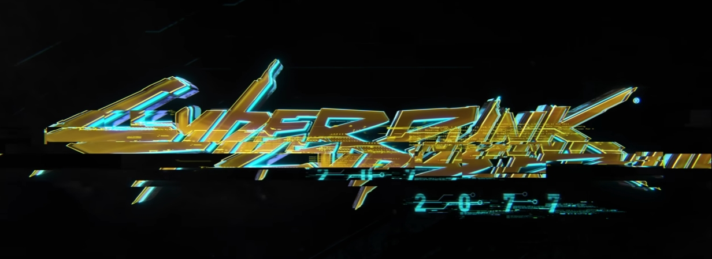
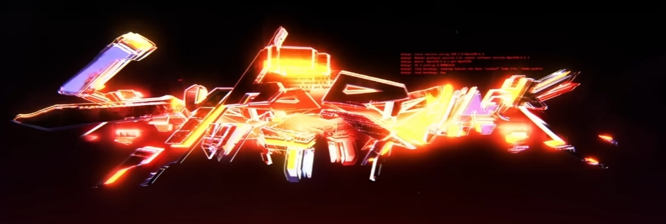

# czhu0489_9103_tut9 Quiz8

## Part 1: Imaging Technique Inspiration
In the promotional video of Cyberpunk 2077 (GameSpot, 2020), the game's logo has been processed to achieve a visual effect of **glitch art**. Glitch art is a form of visual art expression that artistically processes the broken images caused by the device failures. As an art full of randomness, glitch effect is a creative imaging technique which can be precisely controlled by codes. Applying glitch art in the assignment not only achieves a striking visual effect by combining hand-drawn paintings with digital patterns from codes, but also can incorporate adaptations in various aspects such as animation, sound, and interaction.

## Part 2: Coding Technique Exploration
**RGB split glitch** is one of the implementation forms of glitch art. This coding technique can separate the RGB colors of the original image to achieve the visual effect of distortion. The key point of implementing the algorithm lies in that the three channels of red, green and blue adopt different uv offset values for separate sampling. Generally speaking, among the three color channels of RGB, one channel is selected to use the original uv value, and the other two channels are subjected to uv jitter before sampling.

[**link to original codes: X-PostProcessing-Library**](https://github.com/QianMo/X-PostProcessing-Library/tree/534a22613af8a29ab5719e9e529ccd4ef214da3a/Assets/X-PostProcessing/Effects/GlitchRGBSplit)

## REFERENCE
GameSpot. (2020). *Cyberpunk 2077 — Official Cinematic Trailer | E3 2019*. Youtube. https://www.youtube.com/watch?v=LembwKDo1Dk